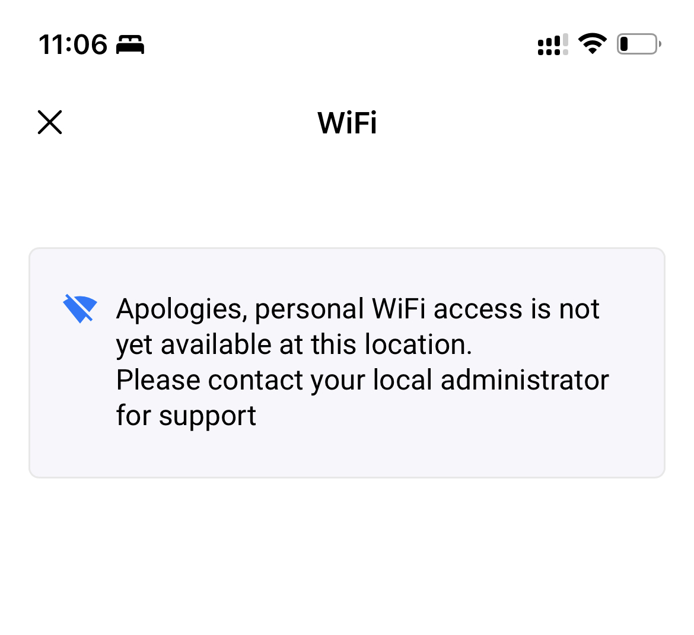

# Optix

Optix integration allow co-working customers managed in the Optix platform ("users") to self provision their WiFi access. There are two ways a user can be provisioned on the WiFi network:

* **via the WiFi Portal**\
  Customers can visit the Tenants Portal - which URL is different per Location - and enter the email address that match a User in Optix.  If the email matches an existing User in Optix, Cusna sends a magic link to login into the Tenant portal to that email. At this point the customer will be able to see and change their own private WiFi passphrase.
* [**via the mobile app**](optix.md#mobile-app-integration)\
  In the alternative they can open the WiFi app inside the Optix App and they will be provisioned automatically.

Note that a User can be associated only to one Account in Cusna. By default, the Account is associated to the Location used for the onboarding. In case of the WiFi Portal, is the Location related to the portal itself (each Location has a dedicated portal). In case of mobile app onboarding, the Location assigned is the Location in Cusna matching the location selected and active in the mobile app when the user open the WiFi app the first time.


Cusna provision automatically access for:

* **Users** who are **Active** and with a valid **Plan**
* Users who have a **Booking** for a resource in the Location they request WiFi access for. The personal PSK by default is valid only until the end of the same day.

#### Team members

If a user belongs to a Team, a matching Group on Cusna will be created for each Team with an assigned VLAN. All users member of the same Team (Group in Cusna) will be provisioned with the same VLAN.


**Accounts termination**

By default all Accounts are created with the service already active and with no termination date, except for Accounts related to bookings that expire the same day.

When a Team Member is **removed** from Optix, it is  also deleted from Cusna automatically and its WiFi access suspended.

When a **Plan is removed** form a Member, Cusna suspends the WiFi service for the user but the account remains in the Cusna account.


### Guidelines in multi-location scenario

If you have multiple active Locations in Optix, users might be able to explore the Content of each one of them and book resources and visit different Locations. When using the mobile app, they can switch Location from the main menu and potentially open the WiFi app form the context of different Locations.

Since a User can be associated to one single Account, the user will only have one WiFi passphrase at a time (with an associated VLAN eventually). In the context of the mobile app, no matter which Location is currenlty active, they will always see the same WiFi passphrase. The account is associated in Cusna to the Location used for the first time onboarding.

If you want users to be able to roam cross locations, you need to use a WiFi network that support multi-site PSKs and perform the correct configuration.&#x20;

For example, in Cambium you might want to use the same WLAN profile for all the AP Groups (Locations). In Mist, you should use Org-level PSKS. In Extreme, deploy the same profile on multiple group of access points. Check the doc related to each vendor for recommendations on how to setup a cross-location community scenario.


## Optix account setup

1. Form your Optix account go to **Apps and Integrations** and click on the tab **DEVELOP**.
2. Click **Create App** and enter a name for your app, such as "_Cusna_". The Edit your app dialog appears. Fill in the optional missing data such as category logo and description.
3.  In the **API Keys** section copy the **Client ID** and the **Organization Token**\
    \


    <figure><figcaption></figcaption></figure>
4. In the **Advanced settings** section, enter the following code

```json
{
"webhooks": [
      {
        "event": "member_deleted", 
        "url": "https://www.cusna.io/api/1.1/wf/optix-memebr-deleted"
     },
     {
        "event": "organization_token_updated", 
        "url": "https://www.cusna.io/api/1.1/wf/optix-tokenupdate"
     }
   ]
}
```

Click **Save** at the bottom of the page.

Take note of of your Optix account **subdomain**. The subdomain is the string just before the "_.optixapp.com_" that you can find in the URL of your browser. In the example below, the subdomain is "_cusna_".

.png>)


### Cusna account setup

1. In your Cusna account, go to **Setting** and scroll to the **Integrations** section. Click **New Integration**. Select **Optix**.
2.  Enter your Optix **Client ID**, **Organization Token** and **Subdomain**  and finally click **Setup**.\
    \


    <figure><figcaption></figcaption></figure>

Once the Optix integration setup is complete, you can link exisitng Locations to Optix location, wither new or exisitn gones.

When you create or edit a Location in Cusna, a new dropdown menu allows to select the matching location in Optix.

.png>)


## Mobile App integration

Cusna integrates into the Optix app to deliver a full self-serve and simplified experience to users.

Users can find the WiFi tool in the top toolbar and get access immediately to their personal passphrase without any further action.



In order to enable the mobile app integration, you need to edit the Setting section indicated in the step 3 of Optix Setup above as follow:

<pre class="language-json"><code class="lang-json">{
"canvases": [
      {
        "type":"MOBILE_HOME_PRIMARY",
        "url": "https://www.cusna.io/optix/<a data-footnote-ref href="#user-content-fn-1">&#x3C;organization_id></a>",
        "title":"WiFi",
        "icon":"wifi"
      }
    ],
"webhooks": [
      {
        "event": "member_deleted", 
        "url": "https://www.cusna.io/api/1.1/wf/optix-memebr-deleted"
     },
{
        "event": "organization_token_updated", 
        "url": "https://www.cusna.io/api/1.1/wf/optix-tokenupdate"
     }
   ]
}
</code></pre>


In the code above, you need to replace `<organization_id>` with your Cusna accoutn Organization ID.



#### Unmapped Locations


Apps are published on all Optix Locations visible in the mobile app.&#x20;


In case you forgot to map the related Location in Cusna, when users click the WiFi app in the home page, they will get the followign error message.



You can keep track of these events in the Notification box in the Cusna dashboard. An alert will inform you when a user click the WiFi app form an unmapped Location with the related Optix Location ID.

<figure><figcaption></figcaption></figure>


## Workflow Video

The following video shows a sample workflow where a user existing in Optix self onboard via the Tenant Portal and his account and the related group get created in Cusna.



[^1]: Replace this value with your Cusna account Organization ID
