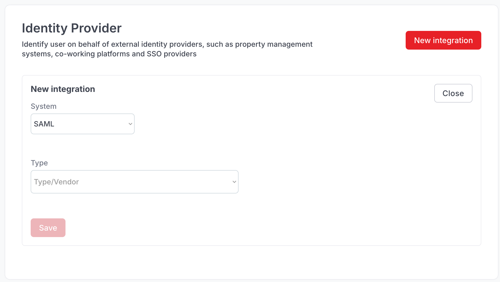

# Microsoft Entra ID (SAML)

### Cusna SAML setup

Go to Integrations and click **New** in the Integration card, then select **SAML**.

<figure><figcaption></figcaption></figure>

Select the type of SSO system from the dropdown list. Based on the SSO system type chosen, the setup steps can slightly differ.

Available SSO systems:

* [Shibboleth](shibboleth.md)


The Setup process requires to operate simultaneously on Cusna and on the Azure Portal. We suggest to keep them open in two different tabs of your browser.


### Step 1: Initialize the connector in Cusna

1. Form your Cusna dashboard, go to **Setup**, **Integration** on the sidebar, then  click **New Integration** button on the card.

<figure><figcaption></figcaption></figure>

2. Form the **System** dropdown, select **SAML**.
3. On the **Type** dropdown, select **Microsoft Entra**.

At this point you'll see two variables getting populated: Reply URL and Entity ID. Copy these two variables as you'll need them in the next step in the Azure Portal.

### Step 2: Setup Azure


Keep your Cusna portal open. **DO NOT CLOSE** the Cusna page.


1. Log in to Microsoft Azure in a new browser tab, click **Enterprise applications** > **New application**.
2.  Click **Create your own application**, enter a name for the application, select **Integrate any other application you don't find in the gallery (Non-gallery)** and click **Create**.\

    
<figure><figcaption></figcaption></figure>

3.  Click **Assign users and group** to define which Users or User groups can login with this application. You can assign individual users or groups of users.\

    <figure><figcaption></figcaption></figure>

    Once done with the assignment, go back to the main page of the app.\

4.  Click **Single sign on** on the sidebar, select **SAML.**\
    The page **Set up Single Sign-On with SAML** appears.\
    \
    Click **Edit** in the "**Basic SAML Configuration**" card.  Enter the **Identifier (Entity ID)** and the **Reply URL** value provided in the Cloud4Wi Dashboard (see top of the page). Click Save.\
    \
    The value will be reflected in the related card.\
    \

    <figure><figcaption></figcaption></figure>
5. Click **Edit** on the "**Attributes & Claims**" card. Default values are usually the correct ones, but make sure that :&#x20;
   1. claim name **Unique User Identifier** matches source attribute **user.userpincipalname**
   2. claim name **groups** matches source attribute **user.groups \[All]**\
      if you don't have this entry, click on the button "**+ Add a group claim**" and select **All groups** in the Group Claims dialog.
   3. claim name **emailaddress** matches source attribute **user.mail**
   4. claim name **givenname** matches source attribute **user.givenname**
   5. claim name **name** matches source attribute **user.name**
   6.  claim name **surname** matches source attribute **user.surname**\
       \

       <figure><figcaption></figcaption></figure>
6.  Go back to the main screen **Set up Single Sign-On with SAML**. Find in the page the section SAML **Certificates**.  Find the attribute **App Federation Metadata Url** and copy its value in the Cusna setup panel in the filed **Metadata URI** \
    \

    <figure><figcaption></figcaption></figure>

    In Cusna, click **Save**.\

7.  Ensure all users can sign on without the need to set up separate permissions in Entra ID. \
    Form the main page of the application,  go to the **Properties** page and select **No** for **Assignment required** and **Yes** to **Visible to users**.\

    <figure><figcaption></figcaption></figure>
