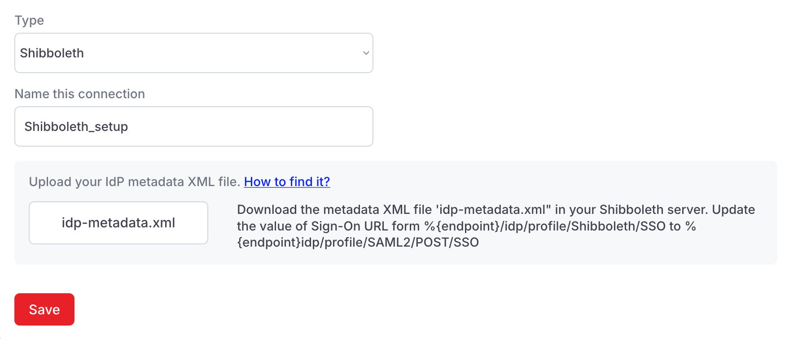
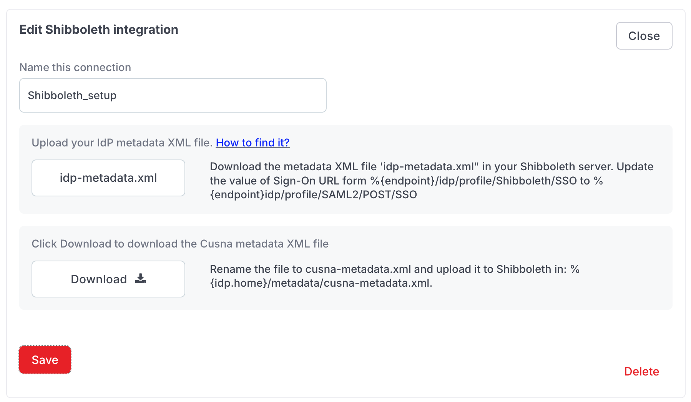

# Shibboleth

### Note

> Throughout this guide, `%{idp.home}` is the directory where you installed your Shibboleth Identity Provider. When configuring Shibboleth, make sure to replace `%{idp.home}` with your specific path (e.g. `/opt/shibboleth`)

### Preliminary steps

1. Download and store the metadata XML file from your Shibboleth server at the following location `%{idp.home}/metadata/idp-metadata.xml` .
2. Update the value of **Sign-On URL** in the IdP metadata file from\
   `%{idp.home}/idp/profile/Shibboleth/SSO` \
   to\
   `%{idp.home}/idp/profile/SAML2/POST/SSO`&#x20;

\


### Cusna setup

1. Go to **Setup** and find the **IdP Integration** card.&#x20;
2. Select **SAML** as **System** and  **Shibboleth** as **Type**.

<figure><figcaption></figcaption></figure>

2. After selecting Shibboleth as SSO system, fill in a name to identify the integration. \
   Then upload the IdP metadata XML file (downloaded in the preliminary step).

<figure><figcaption></figcaption></figure>

3. Once the name is filled and the file is uploaded, click the **Save** button. This action will save the integration data in the Cusna system.

<figure><figcaption></figcaption></figure>

4. Download the **Cusna metadata XML file** from the download section that will appear. Rename the metadata file to `cusna-metadata.xml` .

### Shibboleth server setup

1. Add the following line to the Shibboleth metadata provider file "**metadata-providers.xml"** that can be found at the following location:\
   `%{idp.home}/conf/metadata-providers.xml`&#x20;

```xml
<MetadataProvider id="CusnaMetadata" xsi:type="FilesystemMetadataProvider" metadataFile="%{idp.home}/metadata/cusna-metadata.xml">
```

<details>

<summary>Example</summary>


```xml
<?xml version="1.0" encoding="UTF-8"?>
<MetadataProvider id="ShibbolethMetadata" xsi:type="ChainingMetadataProvider"
    xmlns="urn:mace:shibboleth:2.0:metadata"
    xmlns:security="urn:mace:shibboleth:2.0:security"
    xmlns:saml="urn:oasis:names:tc:SAML:2.0:assertion"
    xmlns:md="urn:oasis:names:tc:SAML:2.0:metadata"
    xmlns:alg="urn:oasis:names:tc:SAML:metadata:algsupport"
    xmlns:ds="http://www.w3.org/2000/09/xmldsig#"
    xmlns:ds11="http://www.w3.org/2009/xmldsig11#"
    xmlns:enc="http://www.w3.org/2001/04/xmlenc#"
    xmlns:enc11="http://www.w3.org/2009/xmlenc11#"
    xmlns:xsi="http://www.w3.org/2001/XMLSchema-instance"
    xsi:schemaLocation="urn:mace:shibboleth:2.0:metadata http://shibboleth.net/schema/idp/shibboleth-metadata.xsd
                        urn:mace:shibboleth:2.0:security http://shibboleth.net/schema/idp/shibboleth-security.xsd
                        urn:oasis:names:tc:SAML:2.0:assertion http://docs.oasis-open.org/security/saml/v2.0/saml-schema-assertion-2.0.xsd
                        urn:oasis:names:tc:SAML:2.0:metadata http://docs.oasis-open.org/security/saml/v2.0/saml-schema-metadata-2.0.xsd
                        urn:oasis:names:tc:SAML:metadata:algsupport http://docs.oasis-open.org/security/saml/Post2.0/sstc-saml-metadata-algsupport-v1.0.xsd
                        http://www.w3.org/2000/09/xmldsig# http://www.w3.org/TR/2002/REC-xmldsig-core-20020212/xmldsig-core-schema.xsd
                        http://www.w3.org/2009/xmldsig11# http://www.w3.org/TR/2013/REC-xmldsig-core1-20130411/xmldsig11-schema.xsd
                        http://www.w3.org/2001/04/xmlenc# http://www.w3.org/TR/xmlenc-core/xenc-schema.xsd
                        http://www.w3.org/2009/xmlenc11# http://www.w3.org/TR/2013/REC-xmlenc-core1-20130411/xenc-schema-11.xsd">


    
    <!-- Element Added for Cusna Integration -->
    <MetadataProvider id="CusnaMetadata"  xsi:type="FilesystemMetadataProvider" metadataFile="%{idp.home}/metadata/cusna-metadata.xml"/>
    <!-- Element Added for Cusna Integration -->
    
  
    
    <MetadataProvider id="incommon" xsi:type="DynamicHTTPMetadataProvider"
                  maxCacheDuration="PT24H" minCacheDuration="PT10M">
      <MetadataFilter xsi:type="SignatureValidation" requireSignedRoot="true"
                  certificateFile="%{idp.home}/credentials/inc-md-cert-mdq.pem" />
      <MetadataFilter xsi:type="RequiredValidUntil" maxValidityInterval="P14D" />
      <MetadataQueryProtocol>https://mdq.incommon.org/</MetadataQueryProtocol>
    </MetadataProvider>
    <MetadataProvider id="TestMetadata"  xsi:type="FilesystemMetadataProvider" metadataFile="/opt/shibboleth-idp/metadata/testsp-metadata.xml"/>
</MetadataProvider>

```


</details>

2. To enable connection between Shibboleth and Cusna, you need to define a new `RelyingParty` element in the file located at `%{idp.home}/conf/relying-party.xml`. \
   Add the following text to the **relying-party.xml**.

```xml
<bean parent="RelyingPartyByName" c:relyingPartyIds="%{entityID}">
    <property name="profileConfigurations">
        <list>
            <bean parent="Shibboleth.SSO" p:postAuthenticationFlows="attribute-release" />
            <bean parent="SAML2.SSO" 
                p:encryptAssertions="false" 
                p:encryptNameIDs="false" 
                p:signResponses="false" 
                p:signAssertions="true" 
                p:nameIDFormatPrecedence="urn:oasis:names:tc:SAML:1.1:nameid-format:emailAddress" />
        </list>
    </property>
</bean>
```


Make sure the `c:relyingPartyIds` (line 1) matches the **entityID** value specified in Cusna metadata XML file **cusna-metadata.xml** (eg.: cusna-14251113262c18bccc2478a05815fa02724db3c619d29d614d22f38e1e7f154b).\



3.  Make sure to configure the attributes names as per the below table in order to make them readable by Cusna. Please note that the attribute naming matches with the SAML2 standard.\


    <table><thead><tr><th width="162" align="center">Cusna attribute</th><th width="113" align="center">Required</th><th align="center">Shibboleth attribute name</th></tr></thead><tbody><tr><td align="center"><strong>email</strong></td><td align="center">yes</td><td align="center">urn:oid:0.9.2342.19200300.100.1.3</td></tr><tr><td align="center"><strong>first name</strong></td><td align="center">no</td><td align="center">urn:oid:2.5.4.42</td></tr><tr><td align="center"><strong>last name</strong></td><td align="center">no</td><td align="center">urn:oid:2.5.4.4</td></tr><tr><td align="center"><strong>group Ids</strong></td><td align="center">no</td><td align="center">urn:oid:1.3.6.1.4.1.5923.1.1.1.1</td></tr></tbody></table>


At this point the integration is correctly configured and users can login using their own credentials.
