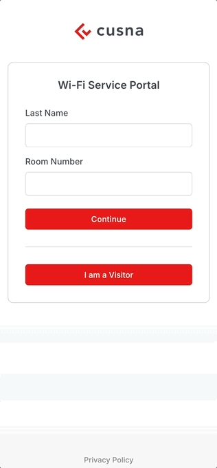

# Apaleo


This is a Beta feature only for partners and customer with access to the Beta Program


**Apaleo PMS** integration enables guests to self-onboard by identifying themselves via **Last Name** and **Room Number** from the WiFi portal. If they have a valid reservation, they receive a personal WiFi Passphrase, which is automatically deactivated at the end of their room stay.

### Cusna setup

Go to Integrations and click **New** in the Integration card, then select **Apaleo**.

Enter the following data:

* **Client Token**
* **Access Token**

<figure><figcaption></figcaption></figure>

Click **Setup**.&#x20;

A new windows will open and prompt you to login with your **Apaleo** account.

If successful, a message informs you that you can close the window.

<figure><figcaption></figcaption></figure>

Going back to the dashboard you'll that the integration is complete.

<figure><figcaption></figcaption></figure>

### Setting up networks for each Hotel

When you create a Network, you need to select the Hotel form a dropdown menu.

<figure><figcaption></figcaption></figure>

### Enabling SSO via **Apaleo**

Go to **Setup**, **Onboarding** and enable the toggle next to **Apaleo**

<figure><figcaption></figcaption></figure>

## User experience

The WiFi portal can be distributed via in-room QR codes or published on a dedicated SSID as a captive portal.

Guests can sign in using their Last Name and Room number and get immediate access to the portal where they’ll can find their personal WiFi passphrase. If PAN is enabled, all devices connected with the same PSK will be in the same network segment (e.g. mobile phones, laptops and personal headless device such as gaming consoles, medical devices, etc..)

<figure><figcaption></figcaption></figure>

