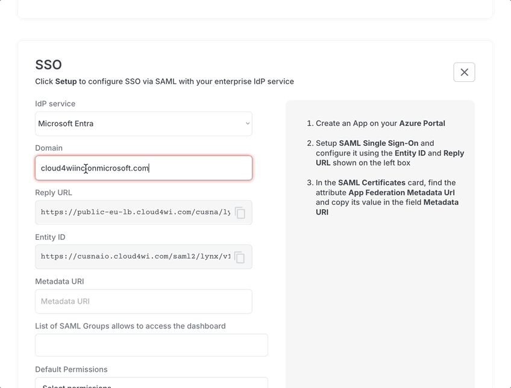
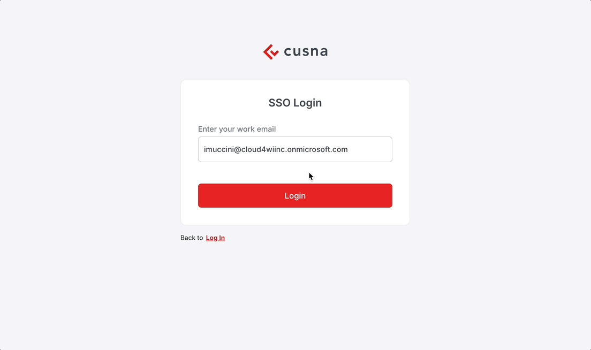

# MSP Account settings

## Account settings

Form the profile menu, click **Account Settings** to access the configuration page of your MSP. This menu is only available to the Admin user set as Owner of the MSP account.

<figure><figcaption></figcaption></figure>

In this page, you can change:

* **MSP Name**
* **MSP Admin Owner**: you can select another MSP Admins (see Admins) to become Owner of this MSP account. if you change owner, you transfer the ownership and you'll lose access to this page immediately
* **Allowed vendors**: this setting limits the list of available WiFi vendors for the managed Organizations &#x20;
* Default Terms of Use
* Default Privacy Policy
* **Logo**: all new Organizations will be initialized with this logo, but the Organization Admin can change it later
* **Accent color**:  all new Organizations will be initialized with this accent color, but the Organization Admin can change it later

## Single Sign On (SSO)

If your MSP is enabled, in this page you can find a card named SSO where you can setup and manage the ability for your corporate users to login into the Cusna MSP account using the corporate account

### Initial Setup

1. To setup SSO click **Setup**.
2. From the **Idp Service** dropdown, select an IdP that supports SAML 2.0 authentication, for example Entra ID, or Okta.
3. in the **Domain** input, enter the domain of your corporate emails (e.g. "cuisna.io")

Depending on the IdP service you picked, you might see different fields, but usually you can copy from the interface:

* Reply URL
* Entity ID

You need these values to setup the SAML authentication into your IdP service.

In the **Metadata URI** you need to enter the value provided by your IdP service.

In the **List of SAML Groups**, you can enter the list of group ids that you want to authorize for authenticating in the Cusna account. If you leave this option empty, all users will be authorized to signup.

Finally, in the **Default Permissions** dropdown you can select the additional permissions you want to assign by default to users signing up via SAML.

Click **Setup** to save the settings.

<figure><figcaption></figcaption></figure>

Make sure to **enable the SSO** by selecting the toggle on the SSO box once you have finalized the setup.

<figure><figcaption></figcaption></figure>

### Users authentication

User can pick the **Sign in via SSO** in the Login page and enter their email address. If they are allowed, they'll be redirected to login in the IdP service login page.

Upon successful authentication, users are logged in to the Cusna MSP dashboard.

<figure><figcaption></figcaption></figure>

