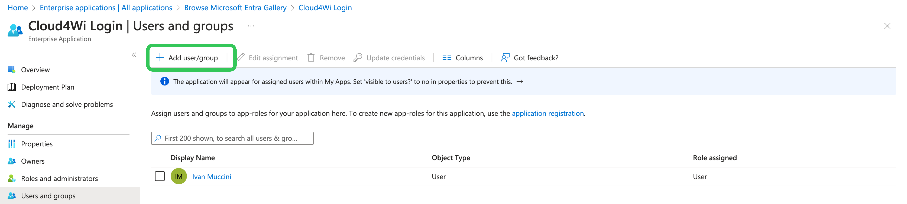
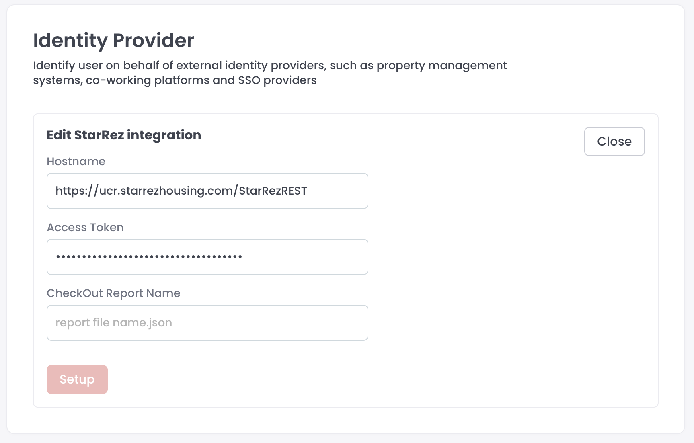

# MSP Account settings

## Account settings

Form the profile menu, click **Account Settings** to access the configuration page of your MSP. This menu is only available to the Admin user set as Owner of the MSP account.

<figure><figcaption></figcaption></figure>

In this page, you can change:

* **MSP Name**
* **MSP Admin Owner**: you can select another MSP Admins (see Admins) to become Owner of this MSP account. if you change owner, you transfer the ownership and you'll lose access to this page immediately
* **Allowed vendors**: this setting limits the list of available WiFi vendors for the managed Organizations &#x20;
* Default **Terms of Use**: all new Organizations will be initialized with this Terms of Use link
* Default **Privacy Policy**: **Use**: all new Organizations will be initialized with this Privacy Policy link
* **Logo**: all new Organizations will be initialized with this logo, but the Organization Admin can change it later
* **Accent color**:  all new Organizations will be initialized with this accent color

## Single Sign On (SSO)

If your MSP is enabled, in this page you can find a card named SSO where you can setup and manage the ability for your corporate users to login into the Cusna MSP account using the corporate account.


Only the MSP Admin with [**Owner**](https://www.cusna.io/app?page=alladmins\&tab=list) role can access this option. Go to the Admins page to check who is the Owner of your MSP account.


### Initial Setup

1. To setup SSO click **Setup**.
2. From the **Idp Service** dropdown, select an IdP that supports SAML 2.0 authentication, for example Entra ID, or Okta.
3. in the **Domain** input, enter the domain of your corporate emails (e.g. "cuisna.io")

Depending on the IdP service you picked, you might see different fields, but usually you can copy from the interface:

* Reply URL
* Entity ID

You need these values to setup the SAML authentication into your IdP service.

Microsoft Entra instructions

* Log in to Microsoft Azure in a new browser tab, click **Enterprise applications** > **New application**.

-   Click **Create your own application**, enter a name for the application, select **Integrate any other application you don't find in the gallery (Non-gallery)** and click **Create**.\

    
<figure><figcaption></figcaption></figure>

*   Click **Assign users and group** to define which Users or User groups can login with this application. You can assign individual users or groups of users.\

    <figure><figcaption></figcaption></figure>

    Once done with the assignment, go back to the main page of the app.\

-   Click **Single sign on** on the sidebar, select **SAML.**\
    The page **Set up Single Sign-On with SAML** appears.\
    \
    Click **Edit** in the "**Basic SAML Configuration**" card.  Enter the **Identifier (Entity ID)** and the **Reply URL** value provided in the Cloud4Wi Dashboard (see top of the page). Click Save.\
    \
    The value will be reflected in the related card.\
    \

    <figure><figcaption></figcaption></figure>

* Click **Edit** on the "**Attributes & Claims**" card. Default values are usually the correct ones, but make sure that :&#x20;
  1. claim name **Unique User Identifier** matches source attribute **user.userpincipalname**
  2. claim name **groups** matches source attribute **user.groups \[All]**\
     if you don't have this entry, click on the button "**+ Add a group claim**" and select **All groups** in the Group Claims dialog.
  3. claim name **emailaddress** matches source attribute **user.mail**
  4. claim name **givenname** matches source attribute **user.givenname**
  5. claim name **name** matches source attribute **user.name**
  6.  claim name **surname** matches source attribute **user.surname**\
      \

      <figure><figcaption></figcaption></figure>

-   Go back to the main screen **Set up Single Sign-On with SAML**. Find in the page the section SAML **Certificates**.  Find the attribute **App Federation Metadata Url** and copy its value in the Cusna setup panel in the filed **Metadata URI** \
    \

    <figure><figcaption></figcaption></figure>

    In Cusna, click **Setup**.

*   Ensure all users can sign on without the need to set up separate permissions in Entra ID. \
    Form the main page of the application,  go to the **Properties** page and select **No** for **Assignment required** and **Yes** to **Visible to users**.\

    <figure><figcaption></figcaption></figure>

Google

1.  Within your Google Workspace admin home page, click **Apps**.

    
2.  Click **Web and mobile apps**.

    
3.  Click **Add App** > **Add custom SAML app**.

    
4. Add an app name and icon (this displays to users when they sign in to WiFi via the Google Workspace login).
5. On the following page click **Download Metadata** to download the metadata XML file, as you need this information to enter into the Cusna portal. You can return to these details at any time.\
   \
   
6.  In the following page, complete the Service provider details as follows:

    | ACS URL        | Enter the **Reply Url** value shown in the Cusna dashboard  |
    | -------------- | ----------------------------------------------------------- |
    | ACS entity     | Enter the **Entity ID** value shown in the Cusna dashboard. |
    | Name ID format | EMAIL                                                       |
    | Name ID        | Basic Information > Primary email                           |
7. Click **Continue** and and in the following page add any additional fields you want to pass to the portal. Common fields include First name and Last name, which should be passed as _firstName_, _lastName_ respectively.\
   In the **Group membership** card, select the Groups that you want to pass during the authentication; you can configure the groups names in the Cunsa porta to filter only the groups that you want to allow.\

8. To complete the set up, click **Finish**.

Form the main screen, click **View Details** form the **User Access** card.\
.png>)\
Make sure to set the **Service Status** to **On for everyone**. In alternative, you can set selective permissions to specific Groups or Organizational Units.

In the **List of SAML Groups**, you can enter the list of group ids/names (depending on the IdP) that you want to authorize for authenticating in the Cusna account. If you leave this option empty, all users will be authorized to signup. This filtering option is checked at every user login, so you can chance at any time.

Finally, in the **Default Permissions** dropdown you can select the additional permissions you want to assign by default to users signing up via SAML. If you change this configuration later on, it will be reflected on the users on their next login.&#x20;

Click **Setup** to save the settings.

<figure><figcaption></figcaption></figure>

Make sure to **enable the SSO** by selecting the toggle on the SSO box once you have finalized the setup.

<figure><figcaption></figcaption></figure>

### Users authentication

User can pick the **Sign in via SSO** in the Login page and enter their email address. If they are allowed, they'll be redirected to login in the IdP service login page.

Upon successful authentication, users are logged in to the Cusna MSP dashboard.

<figure><figcaption></figcaption></figure>

