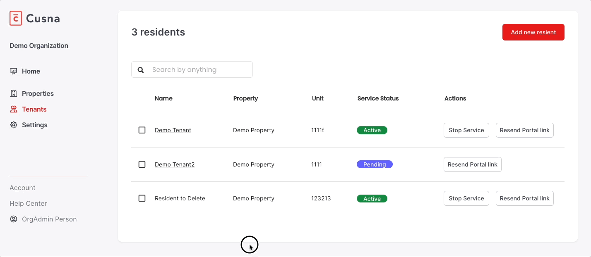
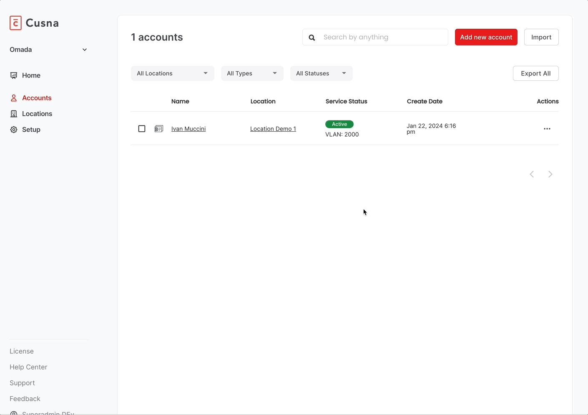

# Managing Accounts


The Accounts page is available for **MSP Managers**, **Organization Managers** and **Network Managers**.


The **Accounts** section allows to:

* [Manually create and provision new Accounts](managing-accounts.md#create-new-accounts)
* [Edit Account details](managing-accounts.md#edit-account-details)
* [Terminate Account WiFi service](managing-accounts.md#terminate-account-wifi-service)
* [Delete Accounts](managing-accounts.md#delete-accounts)
* [Change service auto-termination date and mode](managing-accounts.md#edit-service-termination)
* [Import accounts form CSV](managing-accounts.md#import-accounts-form-csv)
* [Managing Account devices](managing-accounts.md#managing-resident-devices)



## Creating new accounts

Click **Add New Account** button on top of the screen.

Pick a **Network** form the Network dropdown.&#x20;


Note: the Network cannot be changed later


Select the **Type** of account:

* **Tenants**: designed for long-term accounts, for example the tenants of an MDU or the teams/companies in a multi-tenant office building&#x20;
* **Visitors**: designed for temporary account, such individuals booking a room in a flex space for the day. By default, Visitors WiFi access is valid only until the end of the same day of the account provisioning.&#x20;
* **IoT devices**: designed to generate a PPSK to be used by a group of permanent devices that needs to communicate with each others, for example printers or security camera
* **Spaces**: designed to deliver PPSK aimed to br used in specific spaces, such as meeting rooms, where multiple devices and users must be able to collaborate on the same PAN
* **Group Members**: individuals who are part of a Group (for example a Team). Group members inherit certain configurations form the Group they belong to. For example, if VLAN assignment is enabled all Group members by default share the same VLAN. For certain vendors where VLAN management is not supported (e.g. Extreme) all Group Members share the same PSK.

If you are creating an account for a Space or IoT group, you have the option to either **automatically** generate a **passphrase** or enter it **manually**.

<figure><figcaption></figcaption></figure>

Spaces and IoT group account are not associated with a WiFi Portal account so the Admin might want to manually pick a specific keyword.

Whenever you set a passphrase manually, before being able to create the Account you need to click the button **Check** next to the entered passphrase to verify that the passphrase is not already in use in the same Network.

Assign a **VLAN**. If you selected the option to manually assign VLANs in the [General settings](general-options/), you'll see a dropdown where you can pick a VLAN that has not been assigned to other accounts yet.

.png>)

Enter the **Account Details.** The list depends on the Type of account your are creating and might include:

* Unit (optional)
* Port (optional - if Unit has been assigned the the [Port Management option](general-options/service-options.md#units) is enabled)
* Building (optional)
* First name (or Reference name in case of Spaces and IoT devices)
* Last name
* Email address (note: email address must me unique in the account. If a matching email is found, the service will prompt an error)
* Phone number
* Internal account number (for internal reference)

For some vendors, you might have the option to manually assign a [Network Policy](network-policies.md) to the Account. You can either chose to assign the Default network policy assigned to this Network or select one manually among those that have been already provisioned.

<figure><figcaption></figcaption></figure>

In the **Status** section, you can decide when activate and terminate the service.

<figure><figcaption></figcaption></figure>

Select **Service active now** to immediately activate the service for the resident and send the activation email. If you want to activate the service on a future date, select **Schedule activation in the future** and enter the activation date.

In the Service deactivation mode select **Terminate manually**, to manually terminate the service for the account in the future. Otherwise, pick **Schedule stop date** and enter a date when the service will be terminated automatically.

## Edit Account details

Click on the name of account in the main Accounts list to open the Account edit screen.


You cannot change the Network assigned to the account.


Edit any of the fields in the Account Details section and click **Update** button to save the edits.


If you edit the email address, a new activation email will sent to the account.  You can change the email only with another email that is not already assigned to other residents


## Terminate Account WiFi service

You can manually terminate the WiFi service of an active Account at any time.

Find the Account in the main table (using the search box). Click on the Action button to open the action dropdown and select **Suspend Service**. In the following pop-up confirm you want to terminate the service by clicking **Yes**.

<figure><figcaption></figcaption></figure>

## Delete Accounts

To delete one Account, click on the option menu on the table raw of the related account and select **Delete**. You can also find the same options in the Account details screen.

.png>)

To delete one or more Accounts, find them in the main table, click the checkbox next to the reference name of the account. A new button Delete will appear above the table.

Click **Delete** to permanently delete the  account and terminate his service.

## Edit service termination mode and date

You can change at any time the way you will terminate the resident WiFi service.

Find the Account on the main table and click on this name. On the Accounts edit page go to the **Service** section and click **Edit**.

.gif>)

### Import Accounts form CSV

You can import your existing residents in bulk from a CSV file.

Duplicate accounts (with the same email address) will be discarded.

The CSV file must contain the following columns:

* **firstName**: First Name (optional)
* **lastName**: Last Name (optional)
* **email** : Email Address (mandatory)
* **stopDate**: Account termination date (optional) - if empty, the account will be set to be terminated manually. Format: DD/MM/YYYY
* **passphrase**: WiFi Passphrase (optional) - if empty, the passphrase will be generated automatically
* **VLAN**: VLAN (optional) - if empty, the default VLAN mode configured in the general options applies
* **emailValidated**: indicate that the email is Valid. This filed MUSt be set to **True**.

[Download the CSV Template](https://e530a3a8f700b78738cfb414b7013de6.cdn.bubble.io/f1741948712403x824012272319282400/Cusna_import_template.csv?_gl=1*13plzbq*_gcl_au*MTUwNTgzMDgzNi4xNzQxMjQ5NTAz*_ga*NTI2ODQxNzc0LjE3NDEyNDk0ODE.*_ga_BFPVR2DEE2*MTc0MTk0MDc2MS42LjEuMTc0MTk0ODcxNS4yOS4wLjA.) to prepare your data for import.

<figure><figcaption></figcaption></figure>

### Managing resident devices

For certain WiFi vendors (e.g. Meraki) Cusna is able to track all the devices used by each resident and list them in the resident profile page as well as in the Resident Portal.

<figure><figcaption></figcaption></figure>

Depending on the WiFi vendor capabilities, you can also Block and Allow each individual device.

