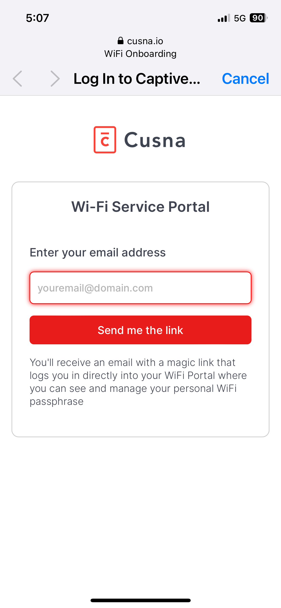
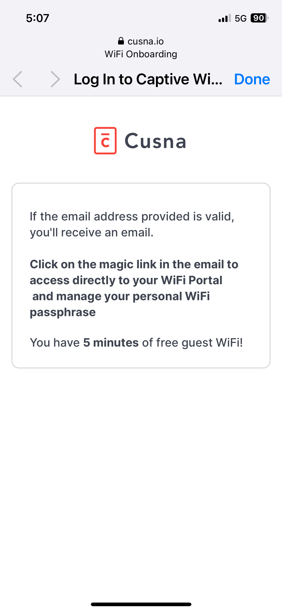

# WiFi Portal distribution

You can share you **WiFi Portal URL** to residents in different ways, such as email or QR codes.

An effective way to make the portal self-discoverable with minimum effort is to publish the portal on a dedicated onboarding WiFi network. For example, you can name it "Resident WiFi onboarding".

When connecting to the network, users are redirected to the authentication page.

<figure><figcaption></figcaption></figure>

Once provided their email, the land on the confirmation screen as usual. With some WiFi vendors, the user is also authenticated on that WiFi network with an allowance of 5 minutes, in order to provide the connectivity while checking the email.

<figure><figcaption></figcaption></figure>

### Configuring the captive portal

To configure the onboarding portal as a captive portal, you simply need to publish the URL of your Network WiFi Portal that you can copy form the dashboard,.

Make sure to add in the walled gardens the domain: \*.cusna.io

#### Special utility for Meraki

If you are using Cusna with Meraki, you can automatically setup your SSID in a few clicks without even using the Meraki dashboard.&#x20;

At the bottom of a Network page, you can find the following card:

<figure><figcaption></figcaption></figure>

Click **Setup** and a popup appears.

<figure><figcaption></figcaption></figure>

Select the **SSID** you want configure, edit the **SSID** **name** and click **Configure**.&#x20;

Cusna will automatically configure the SSID with the proper parameters and publish it.

