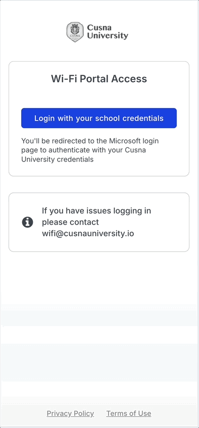

# Student living

## Overview

Campuses and universities are complex environments with a wide range of use cases to address. Cusna, with its PPSK-based connectivity approach, is the ideal solution for providing universal access to managed networks in both on-campus and off-campus living environments. Moreover, once a PPSK is assigned to students, it can also be used on networks beyond the residences and across the campus.

## Network setup

The setup of the infrastructure depends significantly on the vendor chosen for the project and the number of end users it needs to support.

When using network-based PPSK technology (where PPSKs are deployed and managed within network elements), there are often limitations on the number of PPSKs that can be assigned per network segment (learn more).

For example, if the technology limits the number of PPSKs to 5,000 per network, and the campus serves more than 5,000 students, it may be necessary to segment the deployment into multiple networks, such as one network per dormitory or site. In this setup, each PPSK would function only within the network it was assigned to.

To allow students to connect to networks outside their assigned dormitory, they can be encouraged to download a Passpoint profile from their WiFi portal onto their portable devices.

## Onboarding

Students can self-onboard through the WiFi Portal, which serves both as the initial onboarding platform and a hub for managing their service preferences.

The WiFi Portal URL can be shared in several ways, such as:

* Including it in welcome emails and onboarding communications.
* Publishing it in a documentation article on the university’s website or WiFi information page.
* Incorporating it into onboarding materials distributed to students.

Once students access the portal, they can log in using their school credentials. Typically, external IdPs such as [Microsoft Entra](../../cloud-identity-platforms-integrations/enterprise-cloud-idps/microsoft-entra-id-saml.md), [Google](../../cloud-identity-platforms-integrations/enterprise-cloud-idps/google-workspace-oauth.md), or Shibboleth are used for authentication. Administrators must configure the IdP integration in the Cusna dashboard, including setting options such as group mapping and filtering in the onboarding settings.

A common configuration in this scenario is enabling authentication via [IdP SSO](../../service-management/wifi-portal-and-onboarding/#sso-authentication) (using school credentials). The button label presented to students can be customized, for example, “Access with your school credentials.”

A passwordless login option allows students who have already onboarded to log in using just their email address. However, adding this option may create unnecessary complexity and confusion for students. Therefore, it is recommended to disable this feature in such cases ([learn more](../../service-management/wifi-portal-and-onboarding/#passwrodless-login)).

Onboarding flow with Google as IdP

.gif>)

Onboarding flow with Microsoft Entra

## Service lifecycle management

Once students are activated, they can access the network with all their devices.

If they encounter issues connecting a device using PPSK, the [MAC bypass](../../service-management/wifi-portal-and-onboarding/iot-devices-authentication.md) option can be enabled. This allows students to enter their device’s MAC address for authorization via RADIUS. Administrators can assist students by adding and managing these devices through the Dashboard on the Account profile page.

Most IdPs, particularly those relying on the SAML protocol (e.g., Shibboleth), do not provide information about when a user’s access should be terminated. In such cases, planning a de-onboarding strategy is essential.

A simple and effective approach is to enable an [automatic suspension](../../service-management/general-options/service-options.md#automatic-service-termination) of service after a set number of days (e.g., every 90 days). Students are [notified via email](../../service-management/general-options/service-options.md#service-termination-notice) in advance and can easily renew their account by visiting the portal and logging in with SSO.

Another strategy is to assign a generic expiration date to the group the students belong to. In this setup, all users in the group will have their accounts terminated on the configured date.

### Setup demo



